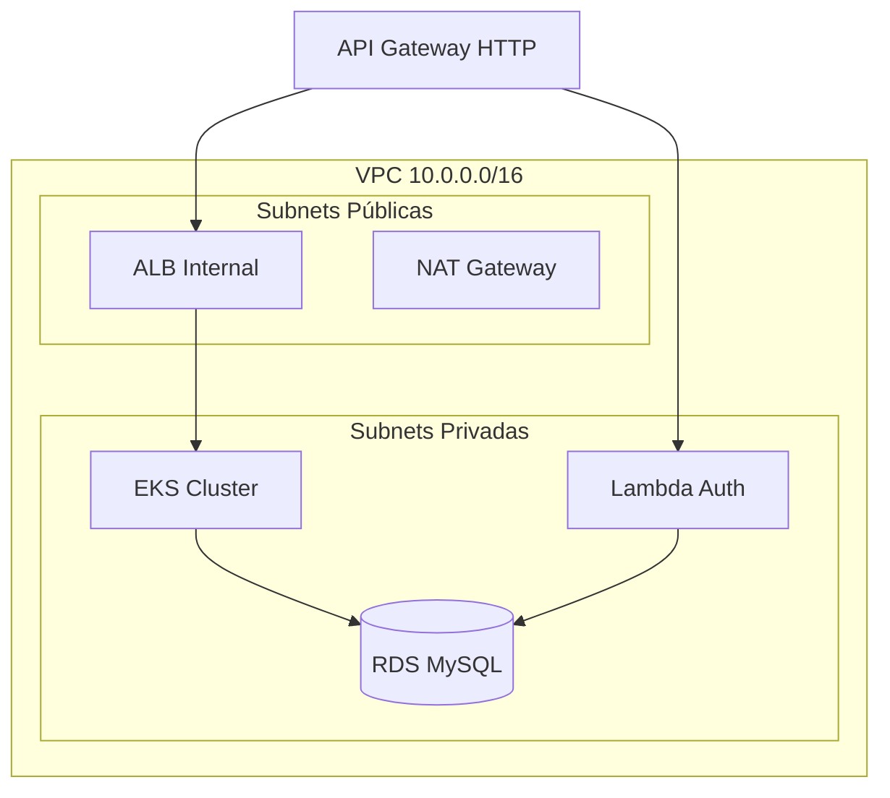

# MotorTech Infra K8s — Terraform EKS + API Gateway

> Infraestrutura Kubernetes (AWS EKS) + API Gateway + Lambda para o sistema MotorTech, provisionada via Terraform.

## Arquitetura



## Tecnologias

- **Terraform** >= 1.5
- **AWS EKS** 1.29
- **AWS API Gateway** (HTTP API)
- **AWS Lambda** (Node.js 20)
- **AWS ECR** (Container Registry)

## Módulos

| Módulo | Descrição |
|--------|-----------|
| `vpc` | VPC, subnets, IGW, NAT Gateway, route tables |
| `eks` | EKS cluster, node group, OIDC, IRSA, add-ons |
| `ecr` | Container registry com lifecycle policy |
| `api-gateway` | HTTP API, rotas, integrações |
| `lambda` | IAM, function, SG, VPC config |
| `security-groups` | SGs para ALB |

## Ambientes

| Ambiente | Diretório | Nodes | Tipo |
|----------|-----------|-------|------|
| Homologation | `environments/homologation/` | 1-3 | SPOT |
| Production | `environments/production/` | 2-5 | ON_DEMAND |

## Pré-requisitos

1. AWS CLI configurado
2. Terraform >= 1.5
3. S3 bucket `motortech-tf-state` criado
4. DynamoDB table `motortech-tf-lock` criada

## Como Usar

```bash
cd environments/homologation
terraform init
terraform plan
terraform apply
```

## CI/CD (GitHub Actions)

| Workflow | Trigger | Ação |
|----------|---------|------|
| `plan.yml` | PR para main | Terraform plan (ambos ambientes) |
| `apply-hml.yml` | Push em homologation | Terraform apply (HML) |
| `apply-prod.yml` | Push em production | Terraform apply (PROD) |
