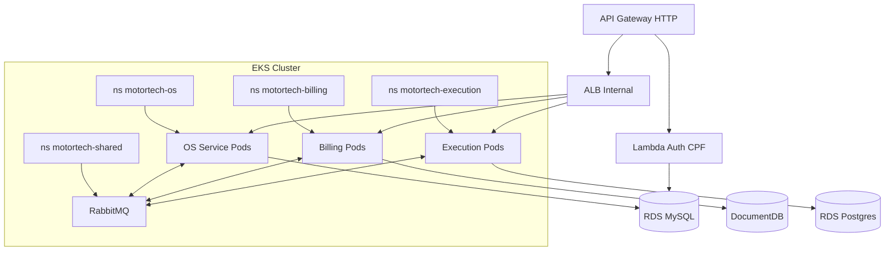

# MotorTech Infra K8s — Terraform EKS + API Gateway + manifests compartilhados

> Infraestrutura Kubernetes (AWS EKS) + API Gateway + Lambda + recursos compartilhados
> (RabbitMQ standalone para HML, monitoramento) que suportam os 3 microsservicos da Fase 4.

## Arquitetura



## Tecnologias

- Terraform >= 1.5
- AWS EKS 1.29
- AWS API Gateway HTTP API
- AWS Lambda Node.js 20
- AWS ECR
- RabbitMQ 3.13 (StatefulSet em HML, AmazonMQ em PROD via `motortech-infra-db`)
- New Relic + Fluent Bit (observabilidade Fase 3 mantida)

## Modulos Terraform

| Modulo | Descricao |
|--------|-----------|
| `vpc` | VPC, subnets, IGW, NAT Gateway |
| `eks` | EKS cluster + node group + OIDC/IRSA + add-ons |
| `ecr` | Container registry com lifecycle policy (1 repo por microsservico) |
| `api-gateway` | HTTP API + rotas + integracao Lambda + ALB |
| `lambda` | Function `motortech-lambda` (auth via CPF) |
| `security-groups` | SGs do ALB e auxiliares |

## Namespaces / manifests compartilhados (k8s-manifests/)

| Arquivo | Conteudo |
|---------|----------|
| `00-namespace.yaml` | `motortech-shared`, `motortech-os`, `motortech-billing`, `motortech-execution` |
| `10-newrelic-infra.yaml` | DaemonSet New Relic Infrastructure |
| `11-fluentbit.yaml` | DaemonSet Fluent Bit (logs centralizados) |
| `20-rabbitmq.yaml` | RabbitMQ StatefulSet (apenas HML; PROD usa AmazonMQ) |

Os manifests do **app de cada microsservico** vivem nos seus respectivos repositorios:
- `motortech-app/k8s/` (OS Service)
- `motortech-billing-service/k8s/` (Billing)
- `motortech-execution-service/k8s/` (Execution)

## Ambientes

| Ambiente | Diretorio | Nodes | Tipo |
|----------|-----------|-------|------|
| Homologation | `environments/homologation/` | 2-4 | SPOT |
| Production | `environments/production/` | 3-8 | ON_DEMAND |

## Como usar

```bash
cd environments/homologation
terraform init
terraform plan
terraform apply

# Aplica manifests compartilhados
aws eks update-kubeconfig --name motortech-eks-hml
kubectl apply -f ../../k8s-manifests/
```

## CI/CD

| Workflow | Trigger | Acao |
|----------|---------|------|
| `plan.yml` | PR para main | Terraform plan (HML + PROD) |
| `apply-hml.yml` | Push em homologation | Apply Terraform + manifests |
| `apply-prod.yml` | Push em production | Apply Terraform + manifests |

## ECR repositorios criados

- `motortech-os` (era `motortech-app`)
- `motortech-billing`
- `motortech-execution`
